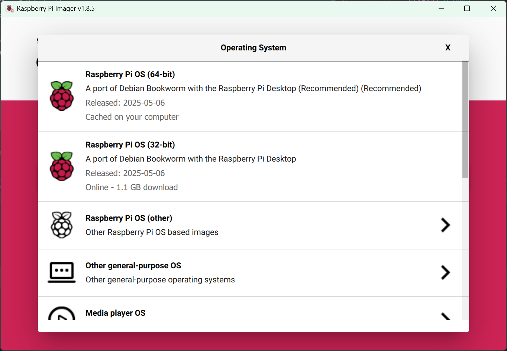
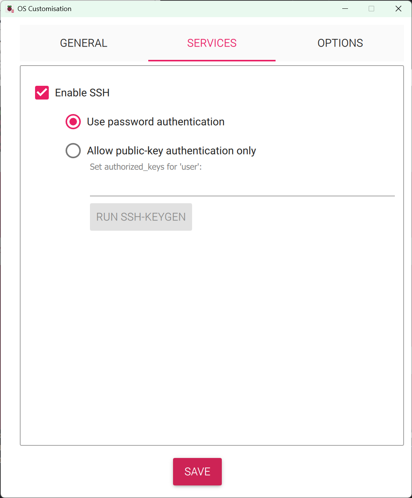
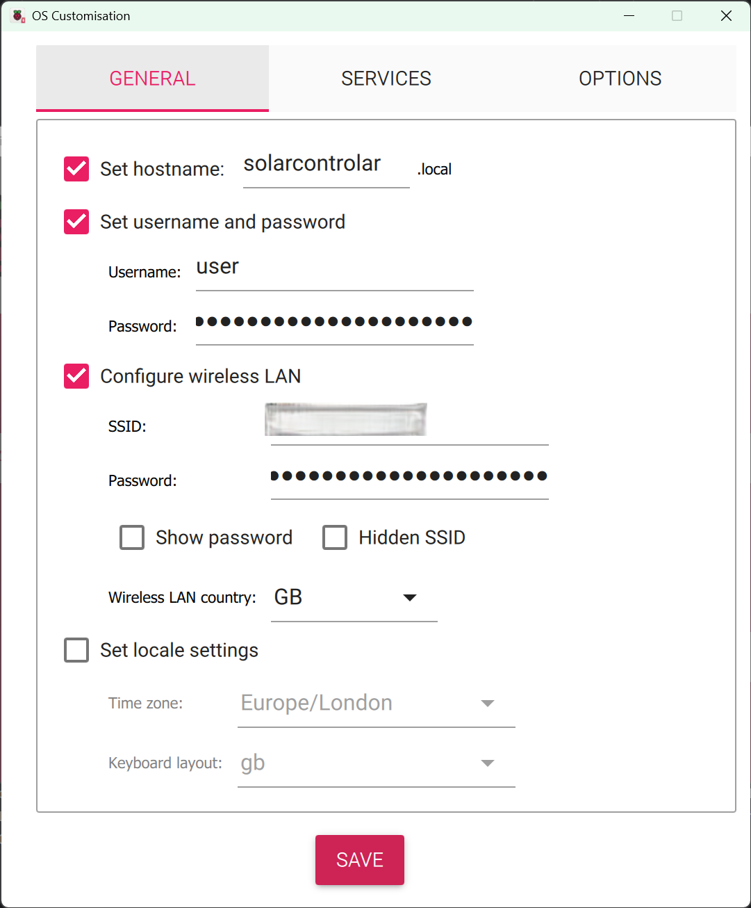

# Create RPi image

use Raspberry Pi Imager: https://www.raspberrypi.com/software/

## Settings
Chose your Pi version

Select the top option Raspberry Pi OS(64-bit)



Then change the settings





**Make sure you select the right device.**
Insert the card and power up your RPi

# Login
```shell
ssh user@solarcontrolar
```
Accept the RSA Key

# Bootstrap
Once you are logged into the RPi

```shell
git clone https://github.com/ownimage/grandad-does-stuff
cd grandad-does-stuff

sudo mkdir /app
sudo chown user /app
cp -R solar-controlar/* /app

cd /app
python -m venv venv
source /app/venv/bin/activate
pip install -r requirements.txt 

```

# Copy files
From **host machine** <base_dir>\grandad-does-stuff\solar-controlar
```shell
scp envfile user@solarcontrolar:/app
scp *.json user@solarcontrolar:/app
```

```shell
cd /app
crontab crontab_file
crontab -l
```

